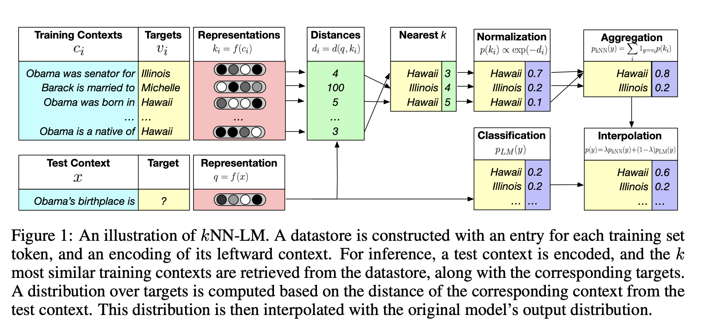

> "If a machine is expected to be infallible, it cannot also be intelligent.”  - Alan Turing

# What is Artificial Intelligence

*[Artificial Intelligence: A Modern
Approach](http://aima.cs.berkeley.edu/index.html)* is the primary textbook through
which many researchers have first entered the "AI" waters. 
When it is asked: "What is Artifical Intelligence?", it is possible we all subconsciously give the
answer embeded within the opening pages of the four editions of this ubuiquitous work. As the
website for the book states: "The leading textbook in Artifical Intelligence,
used in over 1400 schools in over 120 countries."

The manner in which [Peter Norvig](https://norvig.com/) and [Stuart Russell](http://people.eecs.berkeley.edu/~russell/) have
chosen to frame Artificial Intelligence over the course of their editions
has had great influence on how AI has evolved.  The chapters they included, removed, expanded, shrank; the theories they championed or ignored; has had
a profound effect on the conversation and ultimately our understanding of what Artificial Intelligence can and should be.

The first edition of *Artifical Intelligence: A Modern Approach* (commonly referred to as *AIMA*) defined AI as a field that:

> "attempts to understand intelligent entities. Thus, one reason to study it is to learn more about ourselves...AI strives to build intelligent entities as well as understand them"

The second edition of *AIMA* continues the thread of building intelligence but
interestingly drops the argument that the field is also concerned with "knowing
thyself":

> "The field of artificial intelligence...attempts not just to understand but also build intelligent entities"

Wheras *AIMA* 01 makes such claims as "All the researcher has to do is look
in the mirror to see an example of an intelligent system", 
*AIMA* 02 replaces a human-centered approach with a rationality in which at its core 

> "AI systematizes and automates intellectual tasks."

# References

(2020) [The Well Archicted Framework - Machine Learning Lens](https://d1.awsstatic.com/whitepapers/architecture/wellarchitected-Machine-Learning-Lens.pdf)

(2020) [How To Fine-Tune BERT for Text Classification](https://arxiv.org/pdf/1905.05583.pdf)

(2020) [Demystifying Parallel and Distributed Deep Learning: An In-Depth Concurrency Analysis](https://arxiv.org/pdf/1802.09941.pdf)

(2020) [Generalization Through Memorization: Nearest Neighbor Language Models](https://arxiv.org/pdf/1911.00172.pdf) - [Code](https://github.com/lab-ml/nn/tree/master/labml_nn/transformers/knn)

(2020) [Language Models Are Few Shot Learners](https://arxiv.org/pdf/2005.14165.pdf) | [video explanation](https://www.youtube.com/watchv=SY5PvZrJhLE&feature=youtu.be&ab_channel=YannicKilcher)

(2020) [Descending Through A Crowded Valley - Benchmarking Deep Learning Optimizers](https://arxiv.org/pdf/2007.01547.pdf)

(2020) [XiaoiceSing: A High-Quality and Integrated Singing Voice Synthesis System](https://arxiv.org/pdf/2006.06261.pdf)

(2020) [AdaBelief Optimizer: Adapting Stepsizes by the Belief in Observed Gradients](https://arxiv.org/pdf/2010.07468.pdf)

(2020) [Gaussian Error Linear Unit](https://arxiv.org/pdf/1606.08415.pdf)

(2020) [Big Transfer: General Visual Representation Learning](https://arxiv.org/pdf/1912.11370.pdf)

(2020) [Kafka-ML: connecting the data stream with ML/AI frameworks](https://arxiv.org/pdf/2006.04105.pdf) | [code](https://github.com/ertis-research/kafka-ml)

(2020) [A Mache Learning Automated Recommendation Tool for Synthetic Biology](https://www.nature.com/articles/s41467-020-18008-4)

(2020) [Sequence to function deep learning frameworks for engineered riboregulators](https://www.nature.com/articles/s41467-020-18676-2)

(2020) [A Deep Learning Approach to Programmable RNA switches](https://www.nature.com/articles/s41467-020-18677-1)

(2020) [Machine Learning Adoption in Blockchain-Based Smart Applications: The Challenges, and a Way Forward](https://www.researchgate.net/publication/340174274_Machine_Learning_Adoption_in_Blockchain-Based_Smart_Applications_The_Challenges_and_a_Way_Forward)

(2019) [The Scientific Method in the Science of Machine Learning](https://arxiv.org/pdf/1904.10922.pdf)

(2019) [FinBERT: Financial Sentiment Analysis With Pre-Trained Language Models](https://arxiv.org/pdf/1908.10063.pdf,https://github.com/ProsusAI/finBERT)

(2019) [MelNet: A Generative Model for Audio in the Frequency Domain](https://arxiv.org/pdf/1906.01083.pdf) | [Code](https://github.com/Deepest-Project/MelNet)

(2019) [Federated Machine Learning: Concepts and Applications](https://arxiv.org/pdf/1902.04885.pdf)

(2019) [Machine Learning of Designed Translation Control Allows Predictive Pathway Optimization in Escherichia Coli](https://pubs.acs.org/doi/pdf/10.1021/acssynbio.8b00398)

(2019) [Publically Available clinical BERT embeddings](https://github.com/EmilyAlsentzer/clinicalBERT)

(2019) [DocBert: BERT for Document Classification](https://arxiv.org/pdf/1904.08398v3.pdf,https://github.com/castorini/hedwig)

(2019) [Federated Machine Learning Concept and Application)](https://arxiv.org/pdf/1902.04885.pdf)

(2019) [Patient Clustering Improves Efficiency of Federated Machine Learning to predict mortality and hospital stay time using distributed Electronic Medical
Records](https://arxiv.org/ftp/arxiv/papers/1903/1903.09296.pdf)

(2019) [Towards Federated Learning At Scale: System Design](https://arxiv.org/pdf/1902.01046.pdf)

(2019) [Federated learning for mobile keyboard prediction](https://arxiv.org/pdf/1811.03604.pdf)

(2019) [Managing Machine Learning Projects - Balance Potential With the Need for Guardrails](https://d1.awsstatic.com/whitepapers/aws-managing-ml-projects.pdf)

(2019) [Hiearchical Transformers for Long Document Classification](https://arxiv.org/pdf/1910.10781.pdf)

(2019) [BioBert: A Pretrained Biomedical Language Representation Model For Biomedical Text Mining](https://arxiv.org/pdf/1901.08746v4.pdf,https://github.com/dmis-lab/biobert)

(2019) [FastSpeech: Fast, Robust and ControllableText to Speech](https://arxiv.org/pdf/1905.09263.pdf)\

(2019) [Deep Learning in Spiking Neural Networks](https://arxiv.org/pdf/1804.08150.pdf)

(2019) [Lessons from Two Design−Build−Test−Learn Cycles of Dodecanol Production in Escherichia coli Aided by Machine Learning](https://pubs.acs.org/doi/pdf/10.1021/acssynbio.9b00020)

(2018) [Bert: Pre-training of Deep Bidirectional Transformers for Language Understanding](https://arxiv.org/pdf/1810.04805.pdf)

(2018) [Optimizing Revenue Over Data Driven Assortments](https://arxiv.org/pdf/1708.05510.pdf)

(2018) [Deep Learning for Singing Processing:Achievements, Challenges and Impact on Singers and Listeners](https://arxiv.org/pdf/1807.03046.pdf)

(2018) [Leaf: A Federated Learning Benchmark](https://arxiv.org/pdf/1812.01097.pdf)

(2018) [Applied Federated Learning: Improving Google Keyboard Query Suggestions](https://arxiv.org/pdf/1812.02903.pdf)

(2018) [The Simple Essence of Automatic Differentiation](https://arxiv.org/pdf/1804.00746.pdf)

(2018) [Natural TTS Synthesis by Conditioning WaveNet on Mel Spectrogram Predictions](https://arxiv.org/pdf/1712.05884.pdf) -Tacotron 2

(2018) [Demystifying Parallel and Distributed Deep Learning: An In-Depth Concurrency Analysis](https://arxiv.org/pdf/1802.09941.pdf)

**(2017) [Attention is All You Need](https://arxiv.org/pdf/1706.03762.pdf)**

(2017) [Enriching Word Vectors With Subword Informtation](https://arxiv.org/pdf/1607.04606.pdf)

(2017) [Language Modeling with Gated Convolutional Networks](https://arxiv.org/pdf/1612.08083.pdf) - Gated Linear Unit (Glu) implemented in torch.nn.functional

(2017) [Attention-based Extraction of Structured Information from Street View Imagery](https://arxiv.org/pdf/1704.03549.pdf)

(2016) [Federated Optimization: Distributed Machine Learning for On-Device Intelligence](https://arxiv.org/pdf/1610.02527.pdf)

(2016) [Wavenet: A Generative Model For Raw Audio](https://arxiv.org/pdf/1609.03499.pdf)

(2016) [Communication-Efficient Learning of Deep Networks from Decentralized Data](https://arxiv.org/pdf/1602.05629.pdf)

(2016) [NEURAL MACHINE TRANSLATION BY JOINTLY LEARNING TO ALIGN AND TRANSLATE](https://arxiv.org/pdf/1409.0473)

(2015) [Predicting the sequence specificities of DNA and RNA-binding proteins by deep learning](https://cpb-us-w2.wpmucdn.com/u.osu.edu/dist/0/72768/files/2019/01/2016-03-18-Predicting-the-sequence-specificities-of-DNA-and-RNA-binding-proteins-by-deep-learning-1xugui1.pdf)

(2015) [Fractional Max Pooling](https://arxiv.org/pdf/1412.6071.pdf) - Implemented in torch.nn.functional

(2015) [Hidden Technical Debt in Machine Learning Systems](https://papers.nips.cc/paper/2015/file/86df7dcfd896fcaf2674f757a2463eba-Paper.pdf)

(2015) [Delving Deep into Rectifiers: Surpassing Human-Level Performance on ImageNet Classification](https://arxiv.org/pdf/1502.01852.pdf) | - Kaiming Normal  [torch.nn.init.py](https://github.com/pytorch/pytorch/blob/master/torch/nn/init.py#L387), Kaiming Uniform [torch.nn.init.py](https://github.com/pytorch/pytorch/blob/master/torch/nn/init.py#L387)

(2014) [Neural Machine Translation By Jointly Learning to Align and Translate](https://arxiv.org/pdf/1409.0473)

(2014) [Generative Adversarial Nets](https://papers.nips.cc/paper/5423-generative-adversarial-nets.pdf)

(2014) [In Search of an Understandable Consensus Algorithm](https://raft.github.io/raft.pdf) | Raft Consensus Paper

(2013) [Sequence to Sequence Learning With Neural Networks](https://papers.nips.cc/paper/5346-sequence-to-sequence-learning-with-neural-networks.pdf)

(2013) [Linguistic Regularities in Continuous Space Word Representation](https://www.microsoft.com/en-us/research/wp-content/uploads/2016/02/rvecs.pdf)

(2013) [Efficient Estimation of Word Representations in Vector Space](https://arxiv.org/pdf/1301.3781.pdf)

(2012) [ImageNet Classification with Deep Convolutional Neural Networks](http://papers.nips.cc/paper/4824-imagenet-classification-with-deep-convolutional-neural-networks.pdf)

(2012) [Fully Homomorphic Encryption without Bootstrapping](https://eprint.iacr.org/2011/277.pdf) | BVG Homomorphic Encryption Paper

(2011) [Philosophy and the practice of Bayesian statistics](http://www.stat.columbia.edu/~gelman/research/unpublished/philosophy.pdf)

(2004) [Convex Optimization](https://web.stanford.edu/~boyd/cvxbook/bv_cvxbook.pdf)

(2003) [A Neural Probabilistic Language Model](http://www.jmlr.org/papers/volume3/bengio03a/bengio03a.pdf)

(2001) [LIBSVM: A Library for Support Vector Machines](https://www.csie.ntu.edu.tw/~cjlin/papers/libsvm.pdf)

(1999) [An Overview of Statistical Learning Theory](https://www.math.arizona.edu/~hzhang/math574m/Read/vapnik.pdf)

(1999) [Bayesian Model Averaging: A Tutorial](https://projecteuclid.org/download/pdf_1/euclid.ss/1009212519)

(1998) [Approximate Nearest Neighbor: Towards Reducing the Curse of Dimensionality](https://www.theoryofcomputing.org/articles/v008a014/v008a014.pdf)

(1998) [A Beginners Guide to the Mathematics of Neural Networks](http://citeseerx.ist.psu.edu/viewdoc/download?doi=10.1.1.161.3556&rep=rep1&type=pdf&fbclid=IwAR1jmZJ3FBqcNLKbkyKXV3nZ3LaT12M6RoE4gW70TUrLrp-7WJe5LvjQkn4)

(1998) [Sequential Minimal Optimization: A Fast Algorithm for Training Support Vector Machines](https://www.microsoft.com/en-us/research/wp-content/uploads/2016/02/tr-98-14.pdf)

(1998) [Gradient-Based Learning Applied to Document Recognition](http://yann.lecun.com/exdb/publis/pdf/lecun-01a.pdf)

(1996) [Natural Language Understanding](https://mil.ufl.edu/6841/admin/JAllen_1.pdf)

(1995) [Support Vector Networks](https://link.springer.com/content/pdf/10.1023%2FA%3A1022627411411.pdf)

(1994) [Artifical Intelligence: A Modern Approach - First Edition](https://people.eecs.berkeley.edu/~russell/aima1e.html)

(1992) [A Training Algorithm for Optimal Margin Classifier](https://www.svms.org/training/BOGV92.pdf) (SVM)

(1989) [Handwritten Digit Recognition with a Back-Propagration Network](http://papers.nips.cc/paper/293-handwritten-digit-recognition-with-a-back-propagation-network.pdf)

(1986) [Learning and Relearning in Boltzmann Machines](http://www.cs.utoronto.ca/~hinton/absps/pdp7.pdf)

(1985) [Communicating Sequential Processes](http://lass.cs.umass.edu/~shenoy/courses/677/readings/Hoare.pdf) - with a forward by Dijkstra

(1983) [Optimal Perceptual Inference](https://papers.cnl.salk.edu/PDFs/Optimal%20Perceptual%20Inference%201983-646.pdf)

(1982) [Neurons With Graded Response have collective computational properties like those of two state neurons](http://cogsci.ucsd.edu/~sereno/107B/readings/02.02-AttractorCont.pdf)

(1981) [Parallel Models of Associative Memory](http://www.cs.utoronto.ca/~hinton/absps/semantic81.pdf)

(1980) [Principles of Artifical Intelligence](https://ai.stanford.edu/~nilsson/QAI/qai.pdf)

(1978) [An Introduction to Artificial Intelligence: Can Computers Think?](https://archive.org/details/AnIntroductionToArtificialIntelligence)

(1972) [The Humble Programmer](https://www.cs.utexas.edu/users/EWD/ewd03xx/EWD340.PDF) - Djikstra

(1971) [The Complexity of Thereom Proving Procedures](https://www.cs.toronto.edu/~sacook/homepage/1971.pdf)

(1970) [Problem-Solving Methods In Artifical Intelligence](https://cse.buffalo.edu/~rapaport/572/S02/nilsson.8puzzle.pdf)

(1970) [Notes On Structured Programming](https://www.cs.utexas.edu/users/EWD/ewd02xx/EWD249.PDF) - Dijikstra

(1969) [Applied Optimal Control](https://archive.org/details/AppliedOptimalControl/page/n5/mode/2up)

(1967) [Computation:Finite and Infinite Machines](http://www.cba.mit.edu/events/03.11.ASE/docs/Minsky.pdf)

(1965) [Three Approaches to the Quantitative Definition of Information](http://alexander.shen.free.fr/library/Kolmogorov65_Three-Approaches-to-Information.pdf)

(1963) [Recognition of Patterns With Help of Generalized Portraits](http://web.cs.iastate.edu/~cs573x/vapnik-portraits1963.pdf)

(1962) [Applied Dynamic Programming](https://archive.org/details/applieddynamicpr00bell_0)

(1958) [A Learning Machine: Part I,Friedberg](https://exhibits.stanford.edu/feigenbaum/catalog/my986yd0500)

(1957) [The Perceptron: A perceiving and Recognizing Automation](https://blogs.umass.edu/brain-wars/files/2016/03/rosenblatt-1957.pdf)

(1956) [Dynamic Programming](https://www.rand.org/content/dam/rand/pubs/papers/2008/P550.pdf)

(1956) [Distributional Structure](https://www.tandfonline.com/doi/pdf/10.1080/00437956.1954.11659520)

(1954) [Neural Nets and the Brain-Model Problem](https://web.media.mit.edu/~minsky/minskybiog.html)

(1951) [Theory of Reproducing Kernels](https://people.eecs.berkeley.edu/~wainwrig/stat241b/aronszajn.pdf)

(1949) [The Mathematical Theory of Communication](http://people.math.harvard.edu/~ctm/home/text/others/shannon/entropy/entropy.pdf)

(1947) [Numerical Inverting of Matrices of High Order](https://projecteuclid.org/download/pdf_1/euclid.bams/1183511222) | -first scientific computing paper 

(1943) [A Logical Calculus of the Ideas Immanent in Nervous Activity](https://web.csulb.edu/~cwallis/382/readings/482/mccolloch.logical.calculus.ideas.1943.pdf)

(1942) [Some Observations on the Simple Neuron Circuit](https://doi.org/10.1007/BF02477942)

(1933) [Foundations of the Theory of Probability](https://www.york.ac.uk/depts/maths/histstat/kolmogorov_foundations.pdf)

(1913) [An Example of Statistical Investigation in the text of 'Eugene Onegin' illustrating coupling of 'tests' in chains](http://www.alpha60.de/research/markov/DavidLink_AnExampleOfStatistical_MarkovTrans_2007.pdf)

# Notes 

## (2020) [The Well Archicted Framework - Machine Learning Lens](https://d1.awsstatic.com/whitepapers/architecture/wellarchitected-Machine-Learning-Lens.pdf)

The Machine Learning Jouney often has three major outposts:

* AI Services
  *  Fully managed services that enable you to quickly add ML capabilities to your workloads using API calls.
  * Services at this level are based on pre-trained or automatically trained machine learning and deep learning models, so that you don’t need ML knowledge to use them.
* ML Services
  * Managed services and resources for machine learning to developers, data scientists, and researchers.
  * Label data, build, train, deploy, and operate custom ML models without having to worry about the underlying infrastructure needs.
  *  heavy lifting of infrastructure management is managed by the cloud vendor, so that your data science teams can focus on what they do best.
* ML Frameworks and Infrastructure 
  * Design your own tools and workflows to build, train, tune, and deploy models, working at the framework and infrastructure level. 

**Operation Excellence** For Machine Learning:
  * Establish cross functional teams
  * Identify the end-to-end architecture and operational model early
  * Continuously monitor and measure ML workloads
  * Establish a model retraining strategy
  * Document machine learning discovery activities and findings
  * Version machine learning inputs and artifacts
  * Automate machine learning deployment pipelines
 
**Security** for Machine Leanring:
  * Restrict Access to ML systems
  * Ensure Data Governance
  * Enforce Data Lineage
  * Enforce Regulatory Compliance
  
**Reliability** for Machine Learning: 
  *  Manage changes to model inputs through automation
  * Train once and deploy across environments

**Performance Efficiency** for Machine Learning:
  * Optimize compute for your ML workload
  * Define latency and network bandwidth performance requirements for your models
  * Continuously monitor and measure system performance

**Cost Optimization** for Machine Learning:
  * Automate to reduce cost of ownership
  * Experiment with small datasets
  * Right size training and model hosting instances
  * Account for inference architecture based on consumption patterns
  * Define overall ROI and opportunity cost
  
  
Questions to ask:

* MLOPS 01: How have you prepared your team to operate and support a machine learning workload? 
* MLOPS 02: How are you documenting model creation activities? 
* MLOPS 03: How are you tracking model lineage?
* MLOPS 04: How have you automated the development and deployment pipeline for your ML workload?
* MLOPS 05: How are you monitoring and logging model hosting activities?
* MLOPS 06: How do you know when to retrain ML models with new or updated data?
* MLOPS 07: How do you incorporate learnings between iterations of model development, model training, and model hosting?
 

* MLSEC 01: How do you control access to your ML workload?
* MLSEC 02 : How are you protecting and monitoring access to sensitive data used in your ML workloads?
* MLSEC 03: How are you protecting trained ML models?
 

* MLREL 01: How do you manage changes to your machine learning models and prediction endpoints?
* MLREL 02: How are changes to ML models coordinated across your workload?
* MLREL 03: How are you scaling endpoints hosting models for predictions? 
* MLREL 04: How do you recover from failure or inadvertent loss of a trained ML model? 
* MLREL 05: How do you recover from failure or inadvertent loss of model hosting resources? 
 

* MLPER 01: How are you choosing the most appropriate instance type for training and hosting your models?
* MLPER 02: How do you scale your ML workload while maintaining optimal performance?
 

* MLCOST 01: How do you optimize data labeling costs?
* MLCOST 02: How do you optimize costs during ML experimentation?
* MLCOST 03: How do you select the most cost optimal resources for ML training?
* MLCOST 04: How do you optimize cost for ML Inference?

The end-to-end machine learning process includes the following phases:
* Business Goal Identification
* ML Problem Framing
* Data Collection and Integration
* Data Preparation
* Data Visualization and Analytics
* Feature Engineering
* Model Training
* Model Evaluation
* Business Evaluation
* Production Deployment (Model Deployment and Model Inference)

 

**Canary Deployment**

---

## (2020) [Generalization Through Memorization - Nearest Neighbor Language Models](https://arxiv.org/pdf/1911.00172.pdf)

> We introduce kNN-LM, an approach that extends a pre-trained LM by linearly interpolating its next
word distribution with a k-nearest neighbors (kNN) model. The nearest neighbors are computed
according to distance in the pre-trained embedding space and can be drawn from any text collection, including the original LM training data.

> Training a model on 100-million tokens and using kNN search over a 3-billion token dataset can outperform training the same model on all 3-billion tokens, opening a new path for efficiently using large datasets in language models. Similarly, adding out-of-domain data to the datastore makes a single LM useful across multiple domains, again without further training.

> Although the kNN-LM requires no training given an existing LM, it does
add some other computational overheads. Storing the keys and values requires a single forward pass
over the training set, which amounts to a fraction of the cost of training for one epoch on the same
examples. Once the keys are saved, for WIKITEXT-103 building the cache with 103M entries takes
roughly two hours on a single CPU. Finally, running on the validation set took approximately 25
minutes when retrieving 1024 keys. While the cost of building a large cache grows linearly in the
number of entries, it is trivial to parallelize and requires no GPU-based training.

> Section 4.1 has shown that retrieving neighbors from the training data can significantly improve
language modeling performance. This raises the question: can retrieving nearest neighbors from
data be a substitute for training on it? To test this, we train a LM on WIKI-100M and use it to build
a datastore from WIKI-3B, a corpus 30 times larger than the training set. We then compare this
kNN-LM to a vanilla LM trained on the entire WIKI-3B corpus.

> Table 3 shows that, as expected, the model trained on 3B tokens dramatically outperforms the model
trained on 100M tokens, improving perplexity from 19.59 to 15.17. However, adding nearest neighbors retrieval over those 3B examples to the model trained on 100M tokens improves perplexity from 19.59 to 13.73; i.e. retrieving nearest neighbors from the corpus outperforms training on it.
This result suggests that rather than training language models on ever larger datasets, we can use
smaller datasets to learn representations and augment them with kNN-LM over a large corpus.

> the Transformer is expressive
enough to memorize all training examples, learning to do so does not result in context representations
that generalize. In contrast, kNN-LM memorizes training data while improving generalization.
From these experiments, we conjecture that kNN-LM improves performance because (1) the Transformer LM is very good at learning a representation function for contexts with an implicit notion
of similarity, and (2) while the Transformer has capacity to memorize all training examples, doing
so causes its representation to generalize less effectively, but (3) the kNN-LM allows the model to
memorize the training data while retaining an effective similarity function.

> A general trend in machine learning, and in language modeling in particular, is that adding more
data consistently improves performance (Devlin et al., 2019; Radford et al., 2019; Yang et al., 2019;
Liu et al., 2019; Zellers et al., 2019; Shoeybi et al., 2019). Our work offers an alternative method
for scaling language models, in which relatively small models learn context representations, and a
nearest neighbour search acts as a highly expressive classifier.

## (2019) [The Scientific Method in the Science of Machine Learning](https://arxiv.org/pdf/1904.10922.pdf)

> We conjecture that grounding ML research in statistically sound hypothesis testing with careful control of nuisance parameters may encourage the publication of advances that
stand the test of time.

> Proper application of the scientific method can help researchers understand factors of variation in experimental outcomes, as well as the dynamics of
components in ML models, which would aid in ensuring robust performance in real world systems.

> Starting from the assumption that there exists accessible ground truth, the scientific method is a systematic framework for experimentation that allows researchers to make objective statements about
phenomena and gain knowledge of the fundamental workings of a system under investigation. 

> Central to this framework is the formulation of a scientific hypothesis and an expectation that can be falsified through experiments and statistical methods... failure to include these steps is likely to lead to unscientific findings.

> “If the hypothesis is right, then I should expect to observe...”

> At the base of scientific research lies the notion that an experimental outcome is a random variable, and that appropriate statistical machinery must be employed to estimate the properties of its
distribution... Since abundant sampling of observations might be prohibitive due to resource constraints, the role of statistical uncertainties accompanying the measurement becomes vital to interpret the result.

---

## (2019) [Federated Machine Learning Concept and Application](https://arxiv.org/pdf/1902.04885.pdf)

**Secure Multi-party Computation**

provide security proof in a well-defined simulation framework to guarantee complete zeroknowledge, that is, each party knows nothing except its input and output.

**Differential Privacy**

Adding noise to the data, or using generalization methods to obscurecertain sensitive attributes until the third party cannot distinguish the individual, thereby makingthe data impossible to be restore to protect user privacy

**Homomorphic Encryption**

Homomorphic Encryption adopted to protect user data privacy through parameter exchange under the encryption mechanism during machine learning. Unlike differential privacy protection, the data and the model itself are not transmitted, nor can they be guessed by the other party’s data.

**Horizontal federated learning** or sample-based federated learning, 

introduced in the scenarios that data sets share the same feature space but different samples

A horizontal federated learning system typically assumes honest participantsand security against a honest-but-curious server

example two banks in different regions 

k participants with the same data structure collaborativelylearn a machine learning model with the help of a parameter or cloud server

* Step 1: participants locally compute training gradients, mask a selection of gradients withencryption  differential privacy  or secret sharing techniques, and send maskedresults to server
* Step 2: Server performs secure aggregation without learning information about any participant;
* Step 3: Server send back the aggregated results to participants
* Step 4: Participants update their respective model with the decrypted gradients

**Vertical federated learning** or feature-based federated learning

 Is applicable to the cases that two data sets share the same sample ID space but differ in feature space. 
 
 example a bank and an ecommerce company in the same city have the same sample probably
 
 At the end of learning, each party only holds the model parameters associated to its own features, therefore at inference time, the two parties also need to collaborate to generate output.
 
 Part 1.Encrypted entity alignment. 
 
 Part 2. Encrypted model training: 
 
 * Step 1: collaborator C creates encryption pairs, send public key to A and B
 * Step 2: A and B encrypt and exchange the intermediate results for gradient and loss calculations
 * Step 3: A and B computes encrypted gradients and adds additional mask, respectively, and B also computes encrypted loss; A and B send encrypted values to C
 * Step 4: C decrypts and send the decrypted gradients and loss back to A and B; A and B unmask the gradients, update the model parameters accordingly.
 
**Federated Transfer Learning** applies to the scenarios that the two data sets differ not only in samples but also in feature space

a common representation between the two feature space is learned using the limited common sample sets andl ater applied to obtain predictions for samples with only one-side features.

## (2019) [Deep Learning in Spike Neural Networks](https://arxiv.org/pdf/1804.08150.pdf)

> SNNs have some advantages over traditional
neural networks in regard to implementation in special
purpose hardware. At the present, effective training of
traditional deep networks requires the use of energy
intensive high-end graphic cards. Spiking networks have
the interesting property that the output spike trains can be
made sparse in time. An advantage of this in biological
networks is that the spike events consume energy and
that using few spikes which have high information
content reduces energy consumption...Thus, it is possible to create low energy spiking
hardware based on the property that spikes are sparse in
time.

> An SNN architecture consists of spiking neurons and
interconnecting synapses that are modeled by adjustable
scalar weights. The first step in implementing an SNN
is to encode the analog input data into the spike trains
using either a rate based method, some form
of temporal coding, or population coding.

> The learning rule
of an SNN is its most challenging component for developing multi-layer (deep) SNNs, because the nondifferentiability of spike trains limits the popular backpropagation algorithm.

> Spiking enables a type of bio-plausible learning rule that cannot be directly
replicated in non-spiking networks. Neuroscientists have
identified many variants of this learning rule that falls
under the umbrella term spike-timing-dependent plasticity (STDP). Its key feature is that the weight (synaptic
efficacy) connecting a pre- and post-synaptic neuron is
adjusted according to their relative spike times within an
interval of roughly tens of milliseconds in length.

> A more direct approach to taking advantage of power efficient SNNs is to convert an offline trained DNN
to a neuromorphic spiking platform (ANN-to-SNN),
specifically for hardware implementation.

> The main approach to take advantage of spiking
platforms while avoiding the training process of spiking CNNs is to convert an already trained CNN to
a spiking architecture by using the trained synaptic
weights, similar to the ANN-to-SNN conversion method.
Many studies have shown high performance of converted
spiking CNNs (close to conventional CNNs) while using fewer operations and consuming less energy.

(2015) [Hidden Technical Debt in Machine Learning Systems](https://papers.nips.cc/paper/2015/file/86df7dcfd896fcaf2674f757a2463eba-Paper.pdf)

Technical debt: 
 * "the long term costs incurred by moving quickly in software engineering."

Paying technical debt: 
* "The goal is not to add new functionality, but to enable future improvements, reduce errors, and improve maintainability."
* "Deferring such payments results in compounding costs. Hidden debt is dangerous because it compounds silently"

Technical debt may be paid down by 
* refactoring code
* improving unit tests
* deleting dead code
* reducing dependencies
* tightening API's
* improving documentation. 

ML Technical Debt:
* *ML systems have a special capacity for incurring technical debt, because
they have all of the maintenance problems of traditional code plus an additional set of ML-specific
issues.* 
* *This debt may be difficult to detect because it exists at the system level rather than the code
level.*

Types of Technial debt in ML Systems: 
* **Entanglement**
  * Machine learning systems mix signals together, entangling them and making isolation of improvements impossible.
  * No inputs are ever really independent. 
  * CACE principle: Changing Anything Changes Everything. 
  * CACE applies not only to input signals, but also:
    * hyper-parameters
    * learning settings
    * sampling methods
    * convergence thresholds
    * data selection
    * and essentially every other possible tweak.
* **Correction Cascades**
  * A correction model creates a new system dependency... making it significantly
more expensive to analyze improvements to that model in the future.
  * Once in place, a correction cascade can create an
improvement deadlock, as improving the accuracy of any individual component actually leads to
system-level detriments.
* **Undeclared Consumers** 
   * Without access controls, some (model) consumers may be undeclared, silently using
the output of a given model as an input to another system (visibility debt). 
   * Undeclared consumers are expensive at best and dangerous at worst, because they create a hidden
tight coupling of a model to other parts of the stack. Changes to the model will very likely impact these
other parts, potentially in ways that are unintended, poorly understood, and detrimental.
  *  In practice, this tight coupling can radically increase the cost and difficulty of making any changes to the model at all,
even if they are improvements (and can create hidden feedback loops). 
* **Unstable Data Dependencies** 
  * some input signals are unstable, meaning
that they qualitatively or quantitatively change behavior over time.
  * engineering ownership of the input signal is separate from the
engineering ownership of the model that consumes it.
  * This is dangerous because even “improvements” to input signals may
have arbitrary detrimental effects in the consuming system that are costly to diagnose and address.
  * One common **mitigation strategy** for unstable data dependencies is to create a versioned copy of a
given signal.
   * Versioning carries its own costs, however,
     * potential staleness (concept drift not addresssed) 
     * cost to maintain multiple versions of the same signal over time
 * **Underutilized Data Dependencies** 
   * input signals that provide little incremental modeling benefit.
  * These can make an ML system unnecessarily vulnerable to
change, sometimes catastrophically so, even though they could be removed with no detriment
  * Ways of data (feature) creep: 
    * **legacy features** - a feature F is included in a model early in
its development. Over time, F is made redundant by new features but this goes undetected
    * **bundled features** - Sometimes, a group of features is evaluated and found to be beneficial.
Because of deadline pressures or similar effects, all the features in the bundle are added to
the model together, possibly including features that add little or no value.
    * **Epsilon Features** - improving model with new features at high cost of comlexity with little gain to model
    * **Correalted Features** - two features strongly correlated, both given credit but only one is actually causal. If the world changes, correlation might change and the causal feature might be eliminated without having been discovered and extracted. 

## (2011) [Philosophy and the practice of Bayesian statistics](http://www.stat.columbia.edu/~gelman/research/unpublished/philosophy.pdf)

> Bayesian statistics or “inverse probability”—starting with a prior distribution, getting data, and moving to the posterior distribution—is associated with an inductive approach of learning about the general from particulars.

> Rather than testing and attempted falsification, learning proceeds more smoothly: an accretion of evidence is summarized by a posterior distribution, and scientific process is associated with the rise and fall in the posterior probabilities of various models.

> We think most of this received view of Bayesian inference is wrong. Bayesian methods are no more inductive than any other mode of statistical inference.

> The goal of model checking, then, is not to demonstrate the foregone conclusion of falsity as such, but rather to learn how, in particular, this model fails.

> When we find such particular failures, they tell us how the model must be improved; when severe tests cannot find them, the inferences we draw about those aspects of the real world from our fitted model become more credible.

> In designing a good test for model checking, we are interested in finding particular errors which, if present, would mess up particular inferences,
and devise a test statistic which is sensitive to this sort of mis-specification.

> What we are advocating, then, is what Cox and Hinkley (1974) call “pure significance testing,” in which certain of the model’s implications are compared directly to the data, rather than entering into a contest with some alternative model.

> A model is a story of how the data could have been generated; the fitted model should therefore be able to generate synthetic data that look like the real data; failures to do so in important ways indicate faults in the model.

> There are technical problems with methods that purport to determine the posterior probability of models, most notably that in models with continuous parameters, aspects of the model that have essentially no effect on posterior inferences within a model can have huge effects on the comparison of posterior probability among models.

> Complex models can and should be checked and falsified.

---

## Interesting Projects

[Linux Foundation Ai & Data](https://lfaidata.foundation/)

[NNEF - Neural Network Exchange Format](https://www.khronos.org/nnef) - The goal of NNEF is to enable data scientists and engineers to easily transfer trained networks from their chosen training framework into a wide variety of inference engines. NNEF has been designed to be reliably exported and imported across tools and engines such as Torch, Caffe, TensorFlow, Theano, Chainer, Caffe2, PyTorch, and MXNet. 

[Onnx](https://onnx.ai/) - Open Neural Network Exchange

 

[Open CV](https://opencv.org/)

[Tikv](https://tikv.org/)

## Interesting Code

[Annoy](https://github.com/spotify/annoy) - The best Nearest Neighbor for production from Spotify

[Auto-Tikv](https://github.com/tikv/auto-tikv) - Using machine learning to tune database configurations automatically

[Cvxopt](http://cvxopt.org/) - Python for Convex Optimization

[Doc Product](https://github.com/re-search/DocProduct) - Medical Q&A with Deep Language Models 

[Eigen](https://gitlab.com/libeigen/eigen) - A C++ template library for linear algebra: matrices, vectors, numerical solvers, and related algorithms.

[Jax](https://github.com/google/jax) - JAX is Autograd and XLA, brought together for high-performance machine learning research. What’s new is that JAX uses XLA to compile and run your NumPy programs on GPUs and TPUs. Compilation happens under the hood by default, with library calls getting just-in-time compiled and executed.

[LibSVM](https://www.csie.ntu.edu.tw/~cjlin/libsvm/) - Library for SVM

[Tract](https://github.com/sonos/tract) - Sonos sound company making a Rust port of NNEF

---

## Interesting Data

(2019) Preprocessed PubMed Text: [Paper](https://arxiv.org/pdf/1906.05474.pdf) | [Code](https://github.com/ncbi-nlp/BlueBERT/blob/master/README.md#pubmed)

---

### Concepts

AutoRegression
* [Example in Python](https://machinelearningmastery.com/autoregression-models-time-series-forecasting-python/)

Cross Validation 
* [Video Explanation](https://www.youtube.com/embed/TIgfjmp-4BA)
* K-Fold (Leave One Out) [Video Explained](https://www.youtube.com/embed/6dbrR-WymjI)

Differential Programming
* [Differential Programming Manifesto](https://github.com/apple/swift/blob/main/docs/DifferentiableProgramming.md)
* [Conal Elliot Video @ Microsoft Research](https://youtu.be/ne99laPUxN4)

Dropout
* "During training, randomly zeroes some of the elements of the input
    tensor with probability :attr:`p` using samples from a Bernoulli
    distribution."

General Purpose GPU (GPGPU)
* [CUDA Low Level GPU Memory Management](https://developer.nvidia.com/blog/introducing-low-level-gpu-virtual-memory-management/)

Transformers

[The Illustrated Transformer](http://jalammar.github.io/illustrated-transformer/)

Support Vector Machines
* [LibSVM](https://www.csie.ntu.edu.tw/~cjlin/libsvm/) - Library for SVM
* [A Practical Guide to SVM](https://www.csie.ntu.edu.tw/~cjlin/papers/guide/guide.pdf)

# Edge ML

What is Edge ML? "Embedded real-time optimization" (as described in *Convex Optimization")

## [IoT and Edge Computing with Kubernetes WhitePaper](https://docs.google.com/document/d/1We-pRDV9LDFo-vd9DURCPC5-Bum2FvjHUGZ1tacGmk8/edit#heading=h.n4tqqt3iuizs)

> Edge is computing workloads at the client device.

> One of the crucial factors that makes Edge computing different than the pure Cloud based solutions is minimizing network traffic over larger distances between devices (users) and the workloads. **reliability**

> So having data (pre)processed at the edge node can help us deal with bandwidth issues and avoid network saturation.

>  The value of Edge data (pre)processing is not only limited to bandwidth, but can also help to **reduce overall latency** of the system, which is one of the main drivers of Edge computing for many applications.

> With Edge computing architectures, we can enforce policies where sensitive data may never leave the physical environment. **data privacy** 

>  Through enforcing policies on the edge we should be able to provide a better security of the whole system as well, by adding a protection layer closer to the originating source of possible attacks (devices).

## Zephr Os

The Zephyr OS is based on a small-footprint kernel designed for use on resource-constrained and embedded systems: from simple embedded environmental sensors and LED wearables to sophisticated embedded controllers, smart watches, and IoT wireless applications.

[Zephhyr, TF Lite, RiscV Presentation](https://riscv.org/wp-content/uploads/2018/12/zephyr-tensorflow-lite-risc-v.pdf)

[Google + Facebook chose Zephyr for RTOS](https://www.prnewswire.com/news-releases/google-and-facebook-select-zephyr-rtos-for-next-generation-products-301141973.html)

[KubeEdge](https://kubeedge.io/en/) - Cloud Native Foundation Incubated Project

> KubeEdge is an open source system for extending native containerized application orchestration capabilities to hosts at Edge.It is built upon kubernetes and provides fundamental infrastructure support for network, app deployment and metadata synchronization between cloud and edge.

## Concepts

Make [Manual](https://www.gnu.org/software/make/manual/make.html)

[UAT - Universal asynchronous receiver-transmitter](https://en.wikipedia.org/wiki/Universal_asynchronous_receiver-transmitter)
 * a computer hardware device for asynchronous serial communication in which the data format and transmission speeds are configurable.
 * takes bytes of data and transmits the individual bits in a sequential fashion.
 * At the destination, a second UART re-assembles the bits into complete bytes. 
 * Each UART contains a shift register, which is the fundamental method of conversion between serial and parallel forms. 

# Model Hacking / Adversarial Machine Learning

[Macafee Makes A Tesla Go 85MPH in a 35MPH Zone Using Model Hacking](https://www.mcafee.com/blogs/other-blogs/mcafee-labs/model-hacking-adas-to-pave-safer-roads-for-autonomous-vehicles/)
