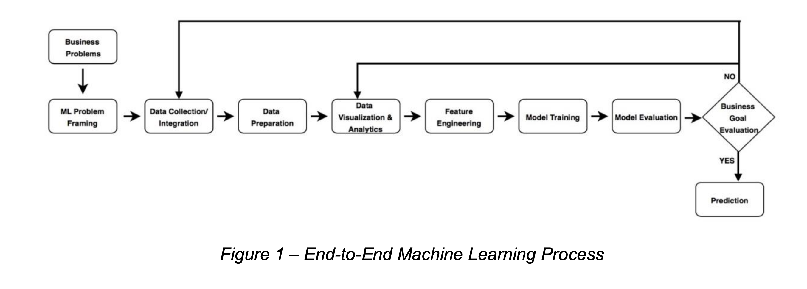
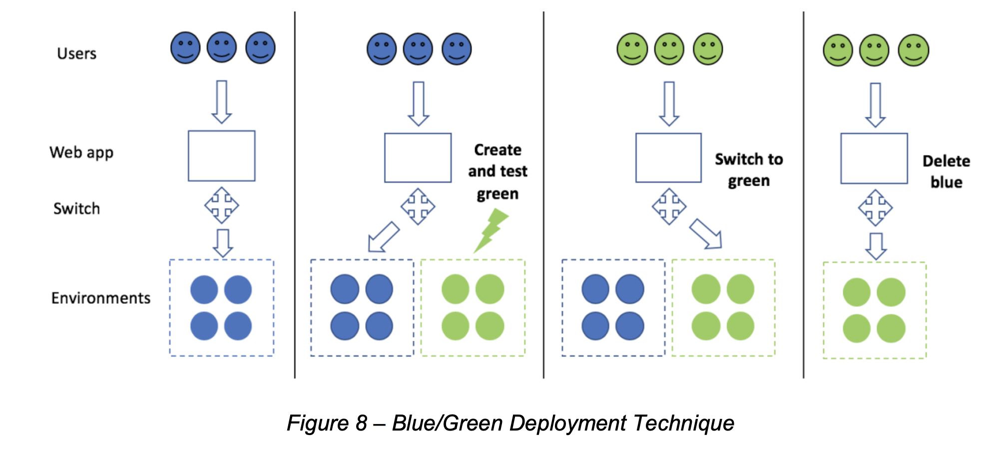
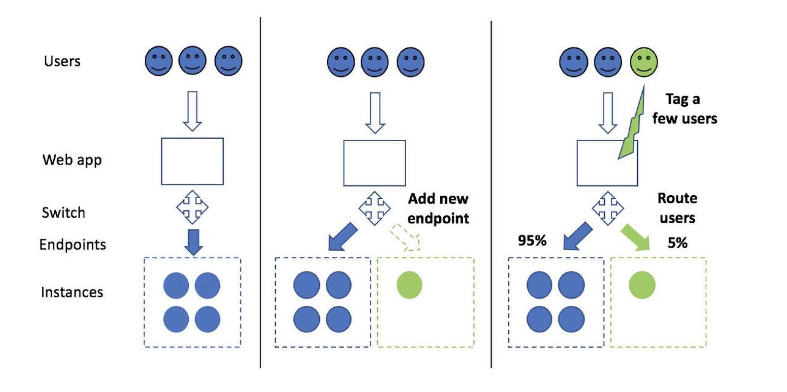

> "If a machine is expected to be infallible, it cannot also be intelligent.”  - Alan Turing

# What is Artificial Intelligence

*[Artificial Intelligence: A Modern
Approach](http://aima.cs.berkeley.edu/index.html)* is the primary textbook through
which many researchers have first entered the "AI" waters. 
When it is asked: "What is Artifical Intelligence?", it is possible we all subconsciously give the
answer embeded within the opening pages of the four editions of this ubuiquitous work. As the
website for the book states: "The leading textbook in Artifical Intelligence,
used in over 1400 schools in over 120 countries."

The manner in which [Peter Norvig](https://norvig.com/) and [Stuart Russell](http://people.eecs.berkeley.edu/~russell/) have
chosen to frame Artificial Intelligence over the course of their editions
has had great influence on how AI has evolved.  The chapters they included, removed, expanded, shrank; the theories they championed or ignored; has had
a profound effect on the conversation and ultimately our understanding of what Artificial Intelligence can and should be.

The first edition of *Artifical Intelligence: A Modern Approach* (commonly referred to as *AIMA*) defined AI as a field that:

> "attempts to understand intelligent entities. Thus, one reason to study it is to learn more about ourselves...AI strives to build intelligent entities as well as understand them"

The second edition of *AIMA* continues the thread of building intelligence but
interestingly drops the argument that the field is also concerned with "knowing
thyself":

> "The field of artificial intelligence...attempts not just to understand but also build intelligent entities"

Wheras *AIMA* 01 makes such claims as "All the researcher has to do is look
in the mirror to see an example of an intelligent system", 
*AIMA* 02 replaces a human-centered approach with a rationality in which at its core 

> "AI systematizes and automates intellectual tasks."

# References

(2020) [The Well Archicted Framework - Machine Learning Lens](https://d1.awsstatic.com/whitepapers/architecture/wellarchitected-Machine-Learning-Lens.pdf)

(2020) [How To Fine-Tune BERT for Text Classification](https://arxiv.org/pdf/1905.05583.pdf)

(2020) [Demystifying Parallel and Distributed Deep Learning: An In-Depth Concurrency Analysis](https://arxiv.org/pdf/1802.09941.pdf)

(2020) [Language Models Are Few Shot Learners](https://arxiv.org/pdf/2005.14165.pdf) | [video explanation](https://www.youtube.com/watchv=SY5PvZrJhLE&feature=youtu.be&ab_channel=YannicKilcher)

(2020) [Descending Through A Crowded Valley - Benchmarking Deep Learning Optimizers](https://arxiv.org/pdf/2007.01547.pdf)

(2020) [XiaoiceSing: A High-Quality and Integrated Singing Voice Synthesis System](https://arxiv.org/pdf/2006.06261.pdf)

(2020) [AdaBelief Optimizer: Adapting Stepsizes by the Belief in Observed Gradients](https://arxiv.org/pdf/2010.07468.pdf)

(2020) [Big Transfer: General Visual Representation Learning](https://arxiv.org/pdf/1912.11370.pdf)

(2020) [A Mache Learning Automated Recommendation Tool for Synthetic Biology](https://www.nature.com/articles/s41467-020-18008-4)

(2020) [Sequence to function deep learning frameworks for engineered riboregulators](https://www.nature.com/articles/s41467-020-18676-2)

(2020) [A Deep Learning Approach to Programmable RNA switches](https://www.nature.com/articles/s41467-020-18677-1)

(2019) [The Scientific Method in the Science of Machine Learning](https://arxiv.org/pdf/1904.10922.pdf)

(2019) [FinBERT: Financial Sentiment Analysis With Pre-Trained Language Models](https://arxiv.org/pdf/1908.10063.pdf,https://github.com/ProsusAI/finBERT)

(2019) [MelNet: A Generative Model for Audio in the Frequency Domain](https://arxiv.org/pdf/1906.01083.pdf) | [Code](https://github.com/Deepest-Project/MelNet)

(2019) [Federated Machine Learning: Concepts and Applications](https://arxiv.org/pdf/1902.04885.pdf)

(2019) [Machine Learning of Designed Translation Control Allows Predictive Pathway Optimization in Escherichia Coli](https://pubs.acs.org/doi/pdf/10.1021/acssynbio.8b00398)

(2019) [Publically Available clinical BERT embeddings](https://github.com/EmilyAlsentzer/clinicalBERT)

(2019) [DocBert: BERT for Document Classification](https://arxiv.org/pdf/1904.08398v3.pdf,https://github.com/castorini/hedwig)

(2019) [Federated Machine Learning Concept and Application)](https://arxiv.org/pdf/1902.04885.pdf)

(2019) [Patient Clustering Improves Efficiency of Federated Machine Learning to predict mortality and hospital stay time using distributed Electronic Medical
Records](https://arxiv.org/ftp/arxiv/papers/1903/1903.09296.pdf)

(2019) [Towards Federated Learning At Scale: System Design](https://arxiv.org/pdf/1902.01046.pdf)

(2019) [Federated learning for mobile keyboard prediction](https://arxiv.org/pdf/1811.03604.pdf)

(2019) [Managing Machine Learning Projects - Balance Potential With the Need for Guardrails](https://d1.awsstatic.com/whitepapers/aws-managing-ml-projects.pdf)

(2019) [Hiearchical Transformers for Long Document Classification](https://arxiv.org/pdf/1910.10781.pdf)

(2019) [BioBert: A Pretrained Biomedical Language Representation Model For Biomedical Text Mining](https://arxiv.org/pdf/1901.08746v4.pdf,https://github.com/dmis-lab/biobert)

(2019) [FastSpeech: Fast, Robust and ControllableText to Speech](https://arxiv.org/pdf/1905.09263.pdf)

(2019) [Lessons from Two Design−Build−Test−Learn Cycles of Dodecanol Production in Escherichia coli Aided by Machine Learning](https://pubs.acs.org/doi/pdf/10.1021/acssynbio.9b00020)

(2018) [Bert: Pre-training of Deep Bidirectional Transformers for Language Understanding](https://arxiv.org/pdf/1810.04805.pdf)

(2018) [Optimizing Revenue Over Data Driven Assortments](https://arxiv.org/pdf/1708.05510.pdf)

(2018) [Deep Learning for Singing Processing:Achievements, Challenges and Impact on Singers and Listeners](https://arxiv.org/pdf/1807.03046.pdf)

(2018) [Leaf: A Federated Learning Benchmark](https://arxiv.org/pdf/1812.01097.pdf)

(2018) [Applied Federated Learning: Improving Google Keyboard Query Suggestions](https://arxiv.org/pdf/1812.02903.pdf)

(2018) [The Simple Essence of Automatic Differentiation](https://arxiv.org/pdf/1804.00746.pdf)

(2018) [Natural TTS Synthesis by Conditioning WaveNet on Mel Spectrogram Predictions](https://arxiv.org/pdf/1712.05884.pdf) -Tacotron 2

(2017) [Attention is All You Need](https://arxiv.org/pdf/1706.03762.pdf) 

(2017) [Enriching Word Vectors With Subword Informtation](https://arxiv.org/pdf/1607.04606.pdf)

(2016) [Federated Optimization: Distributed Machine Learning for On-Device Intelligence](https://arxiv.org/pdf/1610.02527.pdf)

(2016) [Wavenet: A Generative Model For Raw Audio](https://arxiv.org/pdf/1609.03499.pdf)

(2016) [Communication-Efficient Learning of Deep Networks from Decentralized Data](https://arxiv.org/pdf/1602.05629.pdf)

(2016) [NEURAL MACHINE TRANSLATION BY JOINTLY LEARNING TO ALIGN AND TRANSLATE](https://arxiv.org/pdf/1409.0473)

(2015) [Predicting the sequence specificities of DNA and RNA-binding proteins by deep learning](https://cpb-us-w2.wpmucdn.com/u.osu.edu/dist/0/72768/files/2019/01/2016-03-18-Predicting-the-sequence-specificities-of-DNA-and-RNA-binding-proteins-by-deep-learning-1xugui1.pdf)

(2015) [Fractional Max Pooling](https://arxiv.org/pdf/1412.6071.pdf) - Implemented in torch.nn.functional

(2014) [Neural Machine Translation By Jointly Learning to Align and Translate](https://arxiv.org/pdf/1409.0473)

(2014) [Generative Adversarial Nets](https://papers.nips.cc/paper/5423-generative-adversarial-nets.pdf)

(2014) [In Search of an Understandable Consensus Algorithm](https://raft.github.io/raft.pdf) | Raft Consensus Paper

(2013) [Sequence to Sequence Learning With Neural Networks](https://papers.nips.cc/paper/5346-sequence-to-sequence-learning-with-neural-networks.pdf)

(2013) [Linguistic Regularities in Continuous Space Word Representation](https://www.microsoft.com/en-us/research/wp-content/uploads/2016/02/rvecs.pdf)

(2013) [Efficient Estimation of Word Representations in Vector Space](https://arxiv.org/pdf/1301.3781.pdf)

(2012) [ImageNet Classification with Deep Convolutional Neural Networks](http://papers.nips.cc/paper/4824-imagenet-classification-with-deep-convolutional-neural-networks.pdf)

(2011) [Philosophy and the practice of Bayesian statistics](http://www.stat.columbia.edu/~gelman/research/unpublished/philosophy.pdf)

(2003) [A Neural Probabilistic Language Model](http://www.jmlr.org/papers/volume3/bengio03a/bengio03a.pdf)

(2001) [LIBSVM: A Library for Support Vector Machines](https://www.csie.ntu.edu.tw/~cjlin/papers/libsvm.pdf)

(1999) [An Overview of Statistical Learning Theory](https://www.math.arizona.edu/~hzhang/math574m/Read/vapnik.pdf)

(1999) [Bayesian Model Averaging: A Tutorial](https://projecteuclid.org/download/pdf_1/euclid.ss/1009212519)

(1998) [Approximate Nearest Neighbor: Towards Reducing the Curse of Dimensionality](https://www.theoryofcomputing.org/articles/v008a014/v008a014.pdf)

(1998) [A Beginners Guide to the Mathematics of Neural Networks](http://citeseerx.ist.psu.edu/viewdoc/download?doi=10.1.1.161.3556&rep=rep1&type=pdf&fbclid=IwAR1jmZJ3FBqcNLKbkyKXV3nZ3LaT12M6RoE4gW70TUrLrp-7WJe5LvjQkn4)

(1998) [Sequential Minimal Optimization: A Fast Algorithm for Training Support Vector Machines](https://www.microsoft.com/en-us/research/wp-content/uploads/2016/02/tr-98-14.pdf)

(1998) [Gradient-Based Learning Applied to Document Recognition](http://yann.lecun.com/exdb/publis/pdf/lecun-01a.pdf)

(1996) [Natural Language Understanding](https://mil.ufl.edu/6841/admin/JAllen_1.pdf)

(1995) [Support Vector Networks](https://link.springer.com/content/pdf/10.1023%2FA%3A1022627411411.pdf)

(1994) [Artifical Intelligence: A Modern Approach - First Edition](https://people.eecs.berkeley.edu/~russell/aima1e.html)

(1992) [A Training Algorithm for Optimal Margin Classifier](https://www.svms.org/training/BOGV92.pdf) (SVM)

(1989) [Handwritten Digit Recognition with a Back-Propagration Network](http://papers.nips.cc/paper/293-handwritten-digit-recognition-with-a-back-propagation-network.pdf)

(1986) [Learning and Relearning in Boltzmann Machines](http://www.cs.utoronto.ca/~hinton/absps/pdp7.pdf)

(1983) [Optimal Perceptual Inference](https://papers.cnl.salk.edu/PDFs/Optimal%20Perceptual%20Inference%201983-646.pdf)

(1982) [Neurons With Graded Response have collective computational properties like those of two state neurons](http://cogsci.ucsd.edu/~sereno/107B/readings/02.02-AttractorCont.pdf)

(1981) [Parallel Models of Associative Memory](http://www.cs.utoronto.ca/~hinton/absps/semantic81.pdf)

(1980) [Principles of Artifical Intelligence](https://ai.stanford.edu/~nilsson/QAI/qai.pdf)

(1978) [An Introduction to Artificial Intelligence: Can Computers Think?](https://archive.org/details/AnIntroductionToArtificialIntelligence)

(1971) [The Complexity of Thereom Proving Procedures](https://www.cs.toronto.edu/~sacook/homepage/1971.pdf)

(1970) [Problem-Solving Methods In Artifical Intelligence](https://cse.buffalo.edu/~rapaport/572/S02/nilsson.8puzzle.pdf)

(1969) [Applied Optimal Control](https://archive.org/details/AppliedOptimalControl/page/n5/mode/2up)

(1967) [Computation:Finite and Infinite Machines](http://www.cba.mit.edu/events/03.11.ASE/docs/Minsky.pdf)

(1965) [Three Approaches to the Quantitative Definition of Information](http://alexander.shen.free.fr/library/Kolmogorov65_Three-Approaches-to-Information.pdf)

(1963) [Recognition of Patterns With Help of Generalized Portraits](http://web.cs.iastate.edu/~cs573x/vapnik-portraits1963.pdf)

(1962) [Applied Dynamic Programming](https://archive.org/details/applieddynamicpr00bell_0)

(1958) [A Learning Machine: Part I,Friedberg](https://exhibits.stanford.edu/feigenbaum/catalog/my986yd0500)

(1957) [The Perceptron: A perceiving and Recognizing Automation](https://blogs.umass.edu/brain-wars/files/2016/03/rosenblatt-1957.pdf)

(1956) [Dynamic Programming](https://www.rand.org/content/dam/rand/pubs/papers/2008/P550.pdf)

(1956) [Distributional Structure](https://www.tandfonline.com/doi/pdf/10.1080/00437956.1954.11659520)

(1954) [Neural Nets and the Brain-Model Problem](https://web.media.mit.edu/~minsky/minskybiog.html)

(1951) [Theory of Reproducing Kernels](https://people.eecs.berkeley.edu/~wainwrig/stat241b/aronszajn.pdf)

(1949) [The Mathematical Theory of Communication](http://people.math.harvard.edu/~ctm/home/text/others/shannon/entropy/entropy.pdf)

(1947) [Numerical Inverting of Matrices of High Order](https://projecteuclid.org/download/pdf_1/euclid.bams/1183511222) | -first scientific computing paper 

(1943) [A Logical Calculus of the Ideas Immanent in Nervous Activity](https://web.csulb.edu/~cwallis/382/readings/482/mccolloch.logical.calculus.ideas.1943.pdf)

(1942) [Some Observations on the Simple Neuron Circuit](https://doi.org/10.1007/BF02477942)

(1933) [Foundations of the Theory of Probability](https://www.york.ac.uk/depts/maths/histstat/kolmogorov_foundations.pdf)

(1913) [An Example of Statistical Investigation in the text of 'Eugene Onegin' illustrating coupling of 'tests' in chains](http://www.alpha60.de/research/markov/DavidLink_AnExampleOfStatistical_MarkovTrans_2007.pdf)

# Notes 

## (2020) [The Well Archicted Framework - Machine Learning Lens](https://d1.awsstatic.com/whitepapers/architecture/wellarchitected-Machine-Learning-Lens.pdf)

The Machine Learning Jouney often has three major outposts:

* AI Services
  *  Fully managed services that enable you to quickly add ML capabilities to your workloads using API calls.
  * Services at this level are based on pre-trained or automatically trained machine learning and deep learning models, so that you don’t need ML knowledge to use them.
* ML Services
  * Managed services and resources for machine learning to developers, data scientists, and researchers.
  * Label data, build, train, deploy, and operate custom ML models without having to worry about the underlying infrastructure needs.
  *  heavy lifting of infrastructure management is managed by the cloud vendor, so that your data science teams can focus on what they do best.
* ML Frameworks and Infrastructure 
  * Design your own tools and workflows to build, train, tune, and deploy models, working at the framework and infrastructure level. 

**Operation Excellence** For Machine Learning:
  * Establish cross functional teams
  * Identify the end-to-end architecture and operational model early
  * Continuously monitor and measure ML workloads
  * Establish a model retraining strategy
  * Document machine learning discovery activities and findings
  * Version machine learning inputs and artifacts
  * Automate machine learning deployment pipelines
 
**Security** for Machine Leanring:
  * Restrict Access to ML systems
  * Ensure Data Governance
  * Enforce Data Lineage
  * Enforce Regulatory Compliance
  
**Reliability** for Machine Learning: 
  *  Manage changes to model inputs through automation
  * Train once and deploy across environments

**Performance Efficiency** for Machine Learning:
  * Optimize compute for your ML workload
  * Define latency and network bandwidth performance requirements for your models
  * Continuously monitor and measure system performance

**Cost Optimization** for Machine Learning:
  * Automate to reduce cost of ownership
  * Experiment with small datasets
  * Right size training and model hosting instances
  * Account for inference architecture based on consumption patterns
  * Define overall ROI and opportunity cost
  
  
Questions to ask:

* MLOPS 01: How have you prepared your team to operate and support a machine learning workload? 
* MLOPS 02: How are you documenting model creation activities? 
* MLOPS 03: How are you tracking model lineage?
* MLOPS 04: How have you automated the development and deployment pipeline for your ML workload?
* MLOPS 05: How are you monitoring and logging model hosting activities?
* MLOPS 06: How do you know when to retrain ML models with new or updated data?
* MLOPS 07: How do you incorporate learnings between iterations of model development, model training, and model hosting?
 

* MLSEC 01: How do you control access to your ML workload?
* MLSEC 02 : How are you protecting and monitoring access to sensitive data used in your ML workloads?
* MLSEC 03: How are you protecting trained ML models?
 

* MLREL 01: How do you manage changes to your machine learning models and prediction endpoints?
* MLREL 02: How are changes to ML models coordinated across your workload?
* MLREL 03: How are you scaling endpoints hosting models for predictions? 
* MLREL 04: How do you recover from failure or inadvertent loss of a trained ML model? 
* MLREL 05: How do you recover from failure or inadvertent loss of model hosting resources? 
 

* MLPER 01: How are you choosing the most appropriate instance type for training and hosting your models?
* MLPER 02: How do you scale your ML workload while maintaining optimal performance?
 

* MLCOST 01: How do you optimize data labeling costs?
* MLCOST 02: How do you optimize costs during ML experimentation?
* MLCOST 03: How do you select the most cost optimal resources for ML training?
* MLCOST 04: How do you optimize cost for ML Inference?

The end-to-end machine learning process includes the following phases:
* Business Goal Identification
* ML Problem Framing
* Data Collection and Integration
* Data Preparation
* Data Visualization and Analytics
* Feature Engineering
* Model Training
* Model Evaluation
* Business Evaluation
* Production Deployment (Model Deployment and Model Inference)

 

**Canary Deployment**

---

## (2019) [The Scientific Method in the Science of Machine Learning](https://arxiv.org/pdf/1904.10922.pdf)

> We conjecture that grounding ML research in statistically sound hypothesis testing with careful control of nuisance parameters may encourage the publication of advances that
stand the test of time.

> Proper application of the scientific method can help researchers understand factors of variation in experimental outcomes, as well as the dynamics of
components in ML models, which would aid in ensuring robust performance in real world systems.

> Starting from the assumption that there exists accessible ground truth, the scientific method is a systematic framework for experimentation that allows researchers to make objective statements about
phenomena and gain knowledge of the fundamental workings of a system under investigation. 

> Central to this framework is the formulation of a scientific hypothesis and an expectation that can be falsified through experiments and statistical methods... failure to include these steps is likely to lead to unscientific findings.

> “If the hypothesis is right, then I should expect to observe...”

> At the base of scientific research lies the notion that an experimental outcome is a random variable, and that appropriate statistical machinery must be employed to estimate the properties of its
distribution... Since abundant sampling of observations might be prohibitive due to resource constraints, the role of statistical uncertainties accompanying the measurement becomes vital to interpret the result.

---

## (2019) [Federated Machine Learning Concept and Application](https://arxiv.org/pdf/1902.04885.pdf)

**Secure Multi-party Computation**

provide security proof in a well-defined simulation framework to guarantee complete zeroknowledge, that is, each party knows nothing except its input and output.

**Differential Privacy**

Adding noise to the data, or using generalization methods to obscurecertain sensitive attributes until the third party cannot distinguish the individual, thereby makingthe data impossible to be restore to protect user privacy

**Homomorphic Encryption**

Homomorphic Encryption adopted to protect user data privacy through parameter exchange under the encryption mechanism during machine learning. Unlike differential privacy protection, the data and the model itself are not transmitted, nor can they be guessed by the other party’s data.

**Horizontal federated learning** or sample-based federated learning, 

introduced in the scenarios that data sets share the same feature space but different samples

A horizontal federated learning system typically assumes honest participantsand security against a honest-but-curious server

example two banks in different regions 

k participants with the same data structure collaborativelylearn a machine learning model with the help of a parameter or cloud server

* Step 1: participants locally compute training gradients, mask a selection of gradients withencryption  differential privacy  or secret sharing techniques, and send maskedresults to server
* Step 2: Server performs secure aggregation without learning information about any participant;
* Step 3: Server send back the aggregated results to participants
* Step 4: Participants update their respective model with the decrypted gradients

**Vertical federated learning** or feature-based federated learning

 Is applicable to the cases that two data sets share the same sample ID space but differ in feature space. 
 
 example a bank and an ecommerce company in the same city have the same sample probably
 
 At the end of learning, each party only holds the model parameters associated to its own features, therefore at inference time, the two parties also need to collaborate to generate output.
 
 Part 1.Encrypted entity alignment. 
 
 Part 2. Encrypted model training: 
 
 * Step 1: collaborator C creates encryption pairs, send public key to A and B
 * Step 2: A and B encrypt and exchange the intermediate results for gradient and loss calculations
 * Step 3: A and B computes encrypted gradients and adds additional mask, respectively, and B also computes encrypted loss; A and B send encrypted values to C
 * Step 4: C decrypts and send the decrypted gradients and loss back to A and B; A and B unmask the gradients, update the model parameters accordingly.
 
**Federated Transfer Learning** applies to the scenarios that the two data sets differ not only in samples but also in feature space

a common representation between the two feature space is learned using the limited common sample sets andl ater applied to obtain predictions for samples with only one-side features.

## (2011) [Philosophy and the practice of Bayesian statistics](http://www.stat.columbia.edu/~gelman/research/unpublished/philosophy.pdf)

> Bayesian statistics or “inverse probability”—starting with a prior distribution, getting data, and moving to the posterior distribution—is associated with an inductive approach of learning about the general from particulars.

> Rather than testing and attempted falsification, learning proceeds more smoothly: an accretion of evidence is summarized by a posterior distribution, and scientific process is associated with the rise and fall in the posterior probabilities of various models.

> We think most of this received view of Bayesian inference is wrong. Bayesian methods are no more inductive than any other mode of statistical inference.

> The goal of model checking, then, is not to demonstrate the foregone conclusion of falsity as such, but rather to learn how, in particular, this model fails.

> When we find such particular failures, they tell us how the model must be improved; when severe tests cannot find them, the inferences we draw about those aspects of the real world from our fitted model become more credible.

> In designing a good test for model checking, we are interested in finding particular errors which, if present, would mess up particular inferences,
and devise a test statistic which is sensitive to this sort of mis-specification.

> What we are advocating, then, is what Cox and Hinkley (1974) call “pure significance testing,” in which certain of the model’s implications are compared directly to the data, rather than entering into a contest with some alternative model.

> A model is a story of how the data could have been generated; the fitted model should therefore be able to generate synthetic data that look like the real data; failures to do so in important ways indicate faults in the model.

> There are technical problems with methods that purport to determine the posterior probability of models, most notably that in models with continuous parameters, aspects of the model that have essentially no effect on posterior inferences within a model can have huge effects on the comparison of posterior probability among models.

> Complex models can and should be checked and falsified.

---

## Interesting Projects

[Linux Foundation Ai & Data](https://lfaidata.foundation/)

[Onnx](https://onnx.ai/) - Open Neural Network Exchange

[Tikv](https://tikv.org/)

## Interesting Code

[Annoy](https://github.com/spotify/annoy) - The best Nearest Neighbor for production from Spotify

[Auto-Tikv](https://github.com/tikv/auto-tikv) - Using machine learning to tune database configurations automatically

[Cvxopt](http://cvxopt.org/) - Python for Convex Optimization

[Doc Product](https://github.com/re-search/DocProduct) - Medical Q&A with Deep Language Models 

---

## Interesting Data

(2019) Preprocessed PubMed Text: [Paper](https://arxiv.org/pdf/1906.05474.pdf) | [Code](https://github.com/ncbi-nlp/BlueBERT/blob/master/README.md#pubmed)

---

### Concepts

AutoRegression
* [Example in Python](https://machinelearningmastery.com/autoregression-models-time-series-forecasting-python/)

Cross Validation 
* [Video Explanation](https://www.youtube.com/embed/TIgfjmp-4BA)
* K-Fold (Leave One Out) [Video Explained](https://www.youtube.com/embed/6dbrR-WymjI)

Differential Programming
* [Differential Programming Manifesto](https://github.com/apple/swift/blob/main/docs/DifferentiableProgramming.md)
* [Conal Elliot Video @ Microsoft Research](https://youtu.be/ne99laPUxN4)

Transformers

[The Illustrated Transformer](http://jalammar.github.io/illustrated-transformer/)

Support Vector Machines
* [LibSVM](https://www.csie.ntu.edu.tw/~cjlin/libsvm/) - Library for SVM
* [A Practical Guide to SVM](https://www.csie.ntu.edu.tw/~cjlin/papers/guide/guide.pdf)

